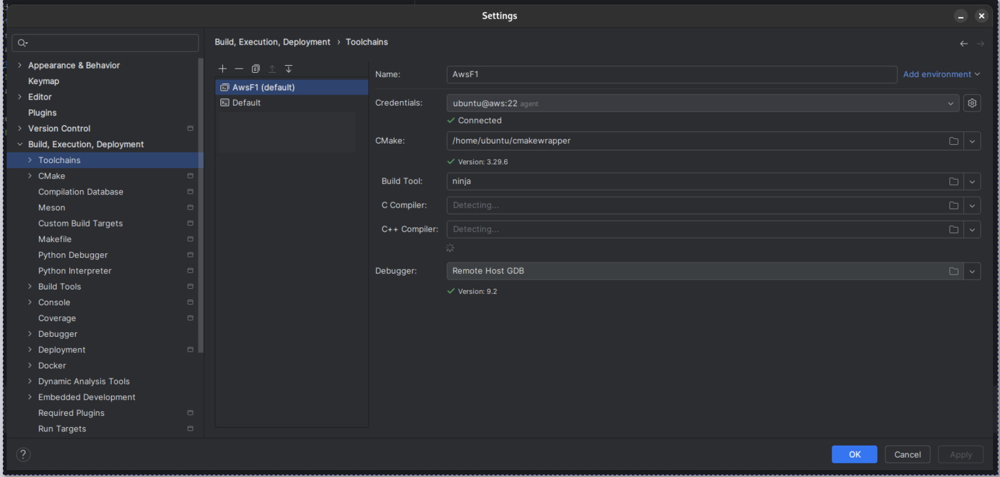
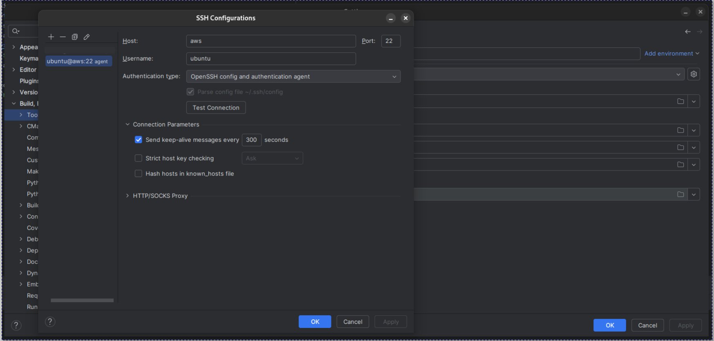
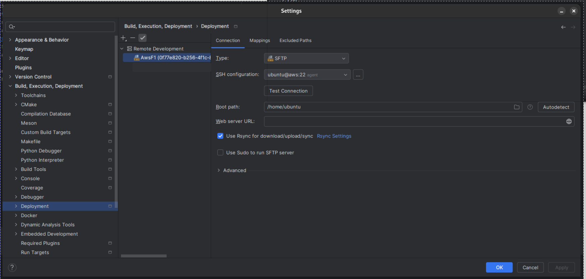

# How to use CLion

## Introduction

For remote development, we can use IDEs like CLion, or editors like VSCode and Zed. This document will show you how to
use CLion for remote development.

## Setup

Before anything, please clone this repository to your remote machine first, and run `f1-ubuntu-2024-1/runme.sh`. This
will create two scripts `cmakewrapper` and `activate.sh` in `~`.

1. Have a remote machine defined in your SSH config file. For example, `aws`. So you can connect to it by running
   `ssh aws`.
2. Go to your CLion settings: `File -> Settings -> Build, Execution, and Deployment -> Toolchain`. 
3. Add a new SSH configuration by clicking the gear button.
4. Then, make sure this ssh entry is set as the default (the default one is bold). 
5. Now, you have to use `cmakewrapper` script instead of the default `cmake` executable on the remote machine. This is
   to make sure that the ENV variables are set correctly. You can read about this
   issue [here](https://intellij-support.jetbrains.com/hc/en-us/community/posts/360009515620-Environment-variables-issues-in-cmake-project-in-remote-ssh-mode-while-building-and-for-build-configs).
6. Go to your CLion settings: `File -> Settings -> Build, Execution, and Deployment -> Deployment`.
7. Make sure `Root Path` is set to the absolute path of your home directory on the remote machine. For example,
   `/home/ubuntu`. 
8. If you face errors like "Failed to collect remote files: failed to determine the file type for CMakeCache.txt", ssh
   to your remote machine and delete `/home/ubuntu/tmp` directory that contains the copied project files.

